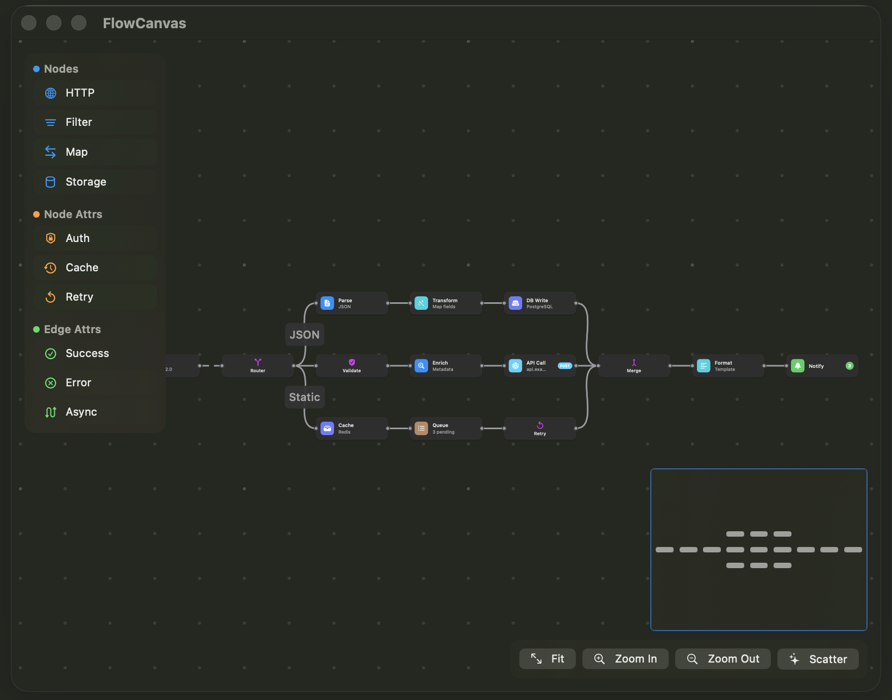

# SwiftFlow

A Canvas-based flow diagram library for SwiftUI, supporting iOS and macOS.



Edges are batch-drawn via `GraphicsContext` for performance. Nodes are rendered as SwiftUI views via `resolveSymbol`, so you can use any SwiftUI view as a node.

## Requirements

- Swift 6.2+
- iOS 26+ / macOS 26+

## Installation

```swift
dependencies: [
    .package(url: "https://github.com/1amageek/swift-flow.git", from: "0.14.0")
]
```

## Quick Start

```swift
import SwiftUI
import SwiftFlow

struct ContentView: View {
    @State var store = FlowStore<String>(
        nodes: [
            FlowNode(id: "a", position: CGPoint(x: 50, y: 100), size: CGSize(width: 120, height: 50), data: "Start"),
            FlowNode(id: "b", position: CGPoint(x: 250, y: 100), size: CGSize(width: 120, height: 50), data: "End"),
        ],
        edges: [
            FlowEdge(id: "e1", sourceNodeID: "a", sourceHandleID: "source", targetNodeID: "b", targetHandleID: "target"),
        ]
    )

    var body: some View {
        FlowCanvas(store: store)
    }
}
```

This renders two nodes connected by a bezier edge. Nodes are draggable, the canvas supports pan and zoom out of the box.

## Core Concepts

### FlowStore

`FlowStore<Data>` is the single source of truth. It is `@Observable` and `@MainActor`.

The generic parameter `Data` is the payload each node carries. It must conform to `Sendable & Hashable` (add `Codable` for serialization).

```swift
// Initialize with nodes and edges
let store = FlowStore<String>(
    nodes: [node1, node2],
    edges: [edge1],
    configuration: FlowConfiguration(
        defaultEdgePathType: .smoothStep,
        snapToGrid: true,
        gridSize: 20
    )
)
```

### FlowNode

Each node has a position, size, and custom data payload.

```swift
FlowNode(
    id: "node-1",
    position: CGPoint(x: 100, y: 200),
    size: CGSize(width: 150, height: 60),     // default: 150x60
    data: "My Node",
    isDraggable: true,                         // default: true
    zIndex: 0,                                 // default: 0
    handles: [                                 // default: target(top), source(bottom)
        HandleDeclaration(id: "in", type: .target, position: .left),
        HandleDeclaration(id: "out", type: .source, position: .right),
    ]
)
```

#### Handles

Handles are connection points on a node. Each handle has an `id`, a `type` (.source or .target), and a `position` (.top, .bottom, .left, .right).

- `.source` handles can connect **to** `.target` handles
- `.target` handles can receive connections **from** `.source` handles

Default handles are `target` at top and `source` at bottom (vertical flow). Override for horizontal layouts:

```swift
let horizontalHandles = [
    HandleDeclaration(id: "target", type: .target, position: .left),
    HandleDeclaration(id: "source", type: .source, position: .right),
]
```

A node can have multiple handles:

```swift
let multiHandles = [
    HandleDeclaration(id: "in", type: .target, position: .left),
    HandleDeclaration(id: "out-yes", type: .source, position: .right),
    HandleDeclaration(id: "out-no", type: .source, position: .bottom),
]
```

### FlowEdge

Edges connect a source handle on one node to a target handle on another node.

```swift
FlowEdge(
    id: "edge-1",
    sourceNodeID: "node-1",
    sourceHandleID: "out",        // matches HandleDeclaration.id on source node
    targetNodeID: "node-2",
    targetHandleID: "in",         // matches HandleDeclaration.id on target node
    pathType: .bezier,            // .bezier | .straight | .smoothStep | .simpleBezier
    label: "Yes"                  // optional label displayed on the edge
)
```

Edge animation is managed separately via the store's `animatedEdgeIDs` side-table — see [Edge Animation](#edge-animation).

### FlowCanvas

The main view. It accepts `@ViewBuilder` closures for customizing node and edge appearance.

```swift
// Default appearance
FlowCanvas(store: store)

// Custom nodes
FlowCanvas(store: store) { node, context in
    MyNodeView(node: node)
}

// Custom nodes + custom edges
FlowCanvas(store: store) { node, context in
    MyNodeView(node: node)
} edgeContent: { edge, geometry in
    geometry.path.stroke(edge.isSelected ? .blue : .gray, lineWidth: 2)
}

// Default nodes + custom edges
FlowCanvas(store: store, edgeContent: { edge, geometry in
    geometry.path.stroke(.red, lineWidth: 2)
})
```

## Custom Node Views

Provide a `@ViewBuilder` closure to `FlowCanvas` that returns any SwiftUI view for each node:

```swift
FlowCanvas(store: store) { node, context in
    VStack(spacing: 4) {
        Text(node.data.title)
            .font(.caption.bold())
        Text(node.data.status)
            .font(.caption2)
            .foregroundStyle(.secondary)
    }
    .padding(8)
    .frame(width: node.size.width, height: node.size.height)
    .background(.background, in: RoundedRectangle(cornerRadius: 8))
    .overlay {
        RoundedRectangle(cornerRadius: 8)
            .strokeBorder(node.isSelected ? .blue : .gray.opacity(0.3))
    }
    .overlay {
        ForEach(node.handles, id: \.id) { handle in
            FlowHandle(handle.id, type: handle.type, position: handle.position)
                .frame(
                    maxWidth: .infinity,
                    maxHeight: .infinity,
                    alignment: handleAlignment(handle.position)
                )
        }
    }
}
```

Key points for custom nodes:
- Set `frame(width: node.size.width, height: node.size.height)` to match the node's declared size
- Use `overlay` with `FlowHandle` views to render connection points at the node edges
- Use `node.isSelected` to show selection state
- Use `node.isHovered` to show hover state (mouse over on macOS, pointer hover on iOS)
- Use `FlowHandle(id, type:, position:)` for each handle in `node.handles`

You can also switch between different node views based on the data:

```swift
FlowCanvas(store: store) { node, context in
    switch node.data {
    case .trigger: TriggerNodeView(node: node)
    case .logic:   LogicNodeView(node: node)
    case .output:  OutputNodeView(node: node)
    }
}
```

## Live Node Views

The default `Canvas` + `resolveSymbol` pipeline rasterizes each node every frame, which is great for pure SwiftUI content but falls apart for `UIViewRepresentable` / `NSViewRepresentable` subtrees — `WKWebView`, `MKMapView`, `AVPlayerView`, SceneKit / RealityKit hosts, etc. Their rendering loops, scroll views, decoders, and input handling require a real SwiftUI view in the tree; a one-shot rasterization leaves them blank, flickering, or frozen on the first frame.

`LiveNode` is a container you declare once inside `nodeContent`. It transparently switches between a **cached snapshot** (drawn by `Canvas` when the node is inactive) and the **real live view** (hosted in a `ZStack` overlay above the `Canvas` when the node is active), from a single call site.

### Basic Usage (SwiftUI-only)

```swift
FlowCanvas(store: store) { node, ctx in
    let inset = FlowHandle.diameter / 2
    LiveNode(node: node) {
        TimelineView(.animation) { tl in
            ClockFace(date: tl.date)
        }
    }
    .padding(inset)
    .overlay { FlowNodeHandles(node: node, context: ctx) }
}
```

For SwiftUI-only content the library re-captures on deactivation using `ImageRenderer` with the full `EnvironmentValues` inherited, so the rasterize path stays consistent with the live phase across the active ↔ inactive transition. `LiveNode` sizes itself to `node.size`, so the caller does **not** need to apply a `.frame(...)` matching the node — just compose any handle padding, clipping, shadows, or overlays around it.

`LiveNode` is a phase dispatcher — its only sizing decision is matching `node.size`. Visual treatment (corner radius, the handle-inset padding that keeps handles on the border from being clipped, background, overlays, etc.) is composed with ordinary SwiftUI modifiers around `LiveNode`. Handle drawing is likewise the caller's responsibility: use `FlowNodeHandles(node:context:)` for the library default look, or compose `FlowHandle` views directly for fully custom handles.

### Native Views (WKWebView / MKMapView / AVPlayerView)

`ImageRenderer` cannot rasterize `UIViewRepresentable` / `NSViewRepresentable` content — `WKWebView`, `MKMapView`, `AVPlayerView`, and similar views render as opaque background. SwiftFlow does not bundle wrappers for individual native frameworks; instead, the wrapping representable participates in the snapshot pipeline by reading `\.liveNodeSnapshotContext` from the environment that `LiveNode` publishes for its descendants:

| Method on ``LiveNodeSnapshotContext`` | Purpose |
|---|---|
| `write(_:)` | Push a snapshot directly — call after a navigation completes (`WKWebView`), a tile pass lands (`MKMapView`), or any other moment the app already has a fresh frame in hand |
| `registerCapture(_:)` | Install an async capture handler that `LiveNode` invokes during the deactivation pipeline — the handler typically reads from the live native view weakly and produces a `FlowNodeSnapshot` |
| `unregisterCapture()` | Clear the handler — call from `dismantleUIView` / `dismantleNSView` so a remount cycle does not leave a stale handler bound to a dead view |
| `requestCapture()` | Drive a capture pass on demand, e.g. to seed the poster shortly after the view first attaches |

The recommended pattern is to own the native view in `@State` and let the representable wire the snapshot context in `makeUIView` / `makeNSView`:

```swift
private struct WebNode: View {
    let node: FlowNode<MyData>
    let url: URL

    @State private var webView = WKWebView()

    var body: some View {
        LiveNode(node: node, mount: .persistent) {
            WebRepresentable(webView: webView, url: url)
        } placeholder: {
            ProgressView()
        }
    }
}

private struct WebRepresentable: UIViewRepresentable {
    let webView: WKWebView
    let url: URL

    @Environment(\.liveNodeSnapshotContext) private var snapshot

    func makeUIView(context: Context) -> WKWebView {
        if webView.url == nil { webView.load(URLRequest(url: url)) }
        snapshot?.registerCapture { [weak webView] in
            await webView?.makeFlowNodeSnapshot()
        }
        return webView
    }

    func updateUIView(_ webView: WKWebView, context: Context) {}

    static func dismantleUIView(_ webView: WKWebView, coordinator: ()) {
        // The View itself can't reach `snapshot` from here; clearing the
        // handler from inside the navigation delegate (which holds the
        // context) is the typical pattern.
    }
}
```

For events that produce a fresh frame outside the deactivation pipeline — `WKNavigationDelegate.didFinish`, `MKMapViewDelegate.mapViewDidFinishRenderingMap`, `AVPlayerItem.didPlayToEndTimeNotification` — call `snapshot.write(_:)` from the delegate. That path is independent of the deactivation-triggered capture handler and lets the poster reflect the latest content immediately.

Snapshot helpers are framework-specific. For `WKWebView`:

```swift
extension WKWebView {
    @MainActor
    func makeFlowNodeSnapshot() async -> FlowNodeSnapshot? {
        let image = try? await takeSnapshot(configuration: WKSnapshotConfiguration())
        guard let cgImage = image?.cgImage else { return nil }
        return FlowNodeSnapshot(cgImage: cgImage, scale: image!.scale)
    }
}
```

`MKMapView` does not have a one-call snapshot method; use `bitmapImageRepForCachingDisplay(in:)` (macOS) or `UIGraphicsImageRenderer.image { drawHierarchy(in:afterScreenUpdates:) }` (iOS). `MKMapView` additionally needs `mount: .remountOnActivation` rather than `.persistent` — see [Mount Policy](#mount-policy) for why.

When the live content is pure SwiftUI, the representable simply does not register a capture handler. `LiveNode` falls back to `ImageRenderer` to produce the deactivation snapshot.

### Mount Policy

`LiveNode` accepts a `mount:` argument that controls whether the overlay row hosting the live subtree is allowed to unmount while the node is inactive.

| `LiveNodeMountPolicy` | Behavior |
|---|---|
| `.onActivation` *(default)* | The row mounts only while the activation predicate is true (or while the first snapshot is being warmed). Once the node deactivates, the live subtree leaves the view tree and the Canvas rasterize path takes over. Suitable for SwiftUI-only content — its state rebuilds from scratch on each remount and the captured snapshot fills the rasterize gap. |
| `.remountOnActivation` | Same mount/unmount cadence as `.onActivation`, but each activation gives the live body a fresh SwiftUI identity so any `@State` resets. **Required for `MKMapView`** — its tile pipeline goes dormant on detach and does not recover when reattached, so each activation needs a brand-new `MKMapView` instance. Also useful for any live content whose internal state needs to be reinitialized per activation. |
| `.persistent` | The row stays mounted continuously while the node is in viewport. The activation predicate only toggles `opacity` and hit-testing — the underlying view never detaches. **Required for `WKWebView`** and other views backed by a long-lived helper process whose compositor stalls when the view is detached (e.g. `AVPlayerView`, `PDFView`). |

Why native views split between `.persistent` and `.remountOnActivation`: `removeFromSuperview` propagates `viewDidMoveToWindow(nil)` into the platform's out-of-process renderer, and different frameworks recover from that differently. `WKWebView`'s WebContent process goes dormant on detach but can be coaxed back to life if the same instance is kept mounted across activation toggles — so `.persistent` works and preserves URL / scroll / JS state for free. `MKMapView`'s tile pipeline also goes dormant on detach, but reattaching the same instance does **not** reliably wake the `CAMetalLayer` pipeline, so each activation must get a fresh `MKMapView` (under `.remountOnActivation`) plus app-layer region persistence to keep pan/zoom across remount cycles.

The cost of `.persistent` is that the helper process keeps running while the node is in viewport even when the user is not interacting with it. The cost of `.remountOnActivation` is that the live view's `@State` is rebuilt on each activation. Pick the policy that matches the framework's lifecycle, and leave SwiftUI-only `LiveNode`s on the default `.onActivation`.

The Poster pattern is unchanged by mount policy: while the node is inactive the Canvas always draws the stored `FlowNodeSnapshot` regardless of whether the live subtree is mounted underneath. `.persistent` only controls visibility, not whether the snapshot is shown.

### Activation

By default a node is active when it is selected or hovered. Override with `.liveNodeActivation`:

```swift
.liveNodeActivation { node, store in
    guard store.connectionDraft == nil else { return false }
    return store.selectedNodeIDs.contains(node.id) || store.hoveredNodeID == node.id
}
```

With `mountPolicy: .persistent`, the overlay subtree stays mounted across activation toggles so `WKWebView` page state, scroll offset, JS execution, and player state all survive a deactivation — the overlay simply hides via opacity + hit-testing. Apps can pause their own internal loops while the node is hidden by reading the published `\.isFlowNodeActive` environment value:

```swift
struct WebViewRepresentable: UIViewRepresentable {
    @Environment(\.isFlowNodeActive) private var isActive
    let url: URL

    func makeUIView(context: Context) -> WKWebView {
        let view = WKWebView()
        view.load(URLRequest(url: url))
        return view
    }

    func updateUIView(_ view: WKWebView, context: Context) {
        isActive ? view.resumeAllMediaPlayback() : view.pauseAllMediaPlayback()
    }
}
```

### Node Drag and Hit Testing

Node drag is always driven by the Canvas's own gesture — multi-selection moves, zoom normalization, and undo registration all live on the Canvas side. What changes between nodes is whether drag events ever *reach* the Canvas.

- **Plain (non-LiveNode) rows.** The overlay row is kept at `opacity = 0` with hit testing disabled, so pointer events pass straight through to the Canvas. No extra work is required.
- **`LiveNode` with non-interactive content** (e.g. a `TimelineView` driving an animation). The content does not consume drags, but the active overlay row is still hit-testable so other gestures could route to it. Mark the live view as pass-through so drags reach the Canvas:

  ```swift
  LiveNode(node: node) {
      TimelineView(.animation) { tl in
          ClockFace(date: tl.date)
      }
  }
  .allowsHitTesting(false)
  ```

- **`LiveNode` with drag-consuming content** (`WKWebView`, `MKMapView`, `AVPlayerView`, or any view containing a `ScrollView` / pan gesture). The live overlay row stays hit-test enabled so the inner view keeps its own scroll / pan / tap. To make the node draggable, wrap a dedicated grip — typically a header bar — in `FlowNodeDragHandle` so its area becomes hit-test transparent and the Canvas's `primaryDragGesture` underneath captures the drag:

  ```swift
  LiveNode(node: node, mount: .persistent) {
      VStack(spacing: 0) {
          FlowNodeDragHandle {
              Text(node.data.title)
                  .frame(maxWidth: .infinity, alignment: .leading)
                  .padding(6)
                  .background(.thinMaterial)
          }
          WebNodeRepresentable(webView: webView, url: url)
      }
  }
  ```

  `FlowNodeDragHandle` does **not** install its own gesture — it just marks `content` with `.allowsHitTesting(false)` so the Canvas's `primaryDragGesture` underneath fires. The drag therefore goes through the same code path as a plain `FlowNode` drag, with one `FlowStore.moveNode` call and one undo entry. While the user is dragging, the live overlay unmounts and the Canvas keeps drawing the rasterized snapshot — so dragging a `WKWebView` / `MKMapView` is as smooth as dragging a plain card.

## Custom Edge Views

Provide an `edgeContent` closure to render each edge as a SwiftUI view. The closure receives a `FlowEdge` and an `EdgeGeometry` with pre-computed path and position data in local coordinates.

```swift
FlowCanvas(store: store) { node, context in
    DefaultNodeContent(node: node, context: context)
} edgeContent: { edge, geometry in
    geometry.path.stroke(
        edge.isSelected ? Color.blue : Color.gray,
        style: StrokeStyle(lineWidth: 2, lineCap: .round)
    )
    if let label = edge.label {
        Text(label)
            .font(.caption2)
            .position(geometry.labelPosition)
    }
}
```

### EdgeGeometry

`EdgeGeometry` provides all the information needed to render an edge. All coordinates are in the view's local coordinate system (bounds origin mapped to (0, 0)).

| Property | Type | Description |
|---|---|---|
| `path` | `Path` | Pre-computed edge path |
| `sourcePoint` | `CGPoint` | Source handle position |
| `targetPoint` | `CGPoint` | Target handle position |
| `sourcePosition` | `HandlePosition` | Source handle direction |
| `targetPosition` | `HandlePosition` | Target handle direction |
| `labelPosition` | `CGPoint` | Suggested label placement |
| `labelAngle` | `Angle` | Suggested label rotation |
| `bounds` | `CGRect` | Canvas-space bounding rect |

### Performance Note

When no `edgeContent` closure is provided, edges are batch-drawn via `GraphicsContext` (3 stroke calls for normal, selected, and animated edges). When custom edge content is provided, each edge is rendered as a Canvas symbol. Connection drafts (in-progress connections) always use the efficient `GraphicsContext` path.

## Handling Connections

When a user drags from a source handle to a target handle, `onConnect` is called. You must create the edge yourself:

```swift
store.onConnect = { [weak store] proposal in
    guard let store else { return }
    let edge = FlowEdge(
        id: UUID().uuidString,
        sourceNodeID: proposal.sourceNodeID,
        sourceHandleID: proposal.sourceHandleID,
        targetNodeID: proposal.targetNodeID,
        targetHandleID: proposal.targetHandleID
    )
    store.addEdge(edge)
}
```

### Connection Validation

By default, self-loop connections (same source and target node) are rejected. Provide a custom validator for more rules:

```swift
struct MyValidator: ConnectionValidating {
    func validate(_ proposal: ConnectionProposal) -> Bool {
        // Reject self-loops
        guard proposal.sourceNodeID != proposal.targetNodeID else { return false }
        // Add custom rules here
        return true
    }
}

let config = FlowConfiguration(connectionValidator: MyValidator())
let store = FlowStore<String>(configuration: config)
```

## Observing Changes

React to state changes via callbacks:

```swift
store.onNodesChange = { changes in
    for change in changes {
        switch change {
        case .add(let node):       print("Added: \(node.id)")
        case .remove(let nodeID):  print("Removed: \(nodeID)")
        case .position(let id, let pos): print("Moved \(id) to \(pos)")
        case .select(let id, let selected): print("\(id) selected: \(selected)")
        case .dimensions(let id, let size): print("\(id) resized to \(size)")
        case .replace(let node):   print("Replaced: \(node.id)")
        }
    }
}

store.onEdgesChange = { changes in
    for change in changes {
        switch change {
        case .add(let edge):       print("Connected: \(edge.id)")
        case .remove(let edgeID):  print("Disconnected: \(edgeID)")
        case .select(let id, let selected): print("\(id) selected: \(selected)")
        case .replace(let edge):   print("Updated: \(edge.id)")
        }
    }
}
```

### Double-Tap

Respond to double-tap (double-click) on nodes and edges:

```swift
store.onNodeDoubleTap = { nodeID in
    print("Double-tapped node: \(nodeID)")
}

store.onEdgeDoubleTap = { edgeID in
    print("Double-tapped edge: \(edgeID)")
}
```

Double-tap detection uses manual timing comparison instead of SwiftUI's `onTapGesture(count: 2)`, which would delay single-tap recognition by ~300ms. Single taps always fire immediately; a second tap within 300ms on the same target triggers the double-tap callback.

## FlowConfiguration

All behavior is configurable:

```swift
FlowConfiguration(
    defaultEdgePathType: .bezier,      // .bezier | .straight | .smoothStep | .simpleBezier
    edgeStyle: EdgeStyle(
        strokeColor: .gray,            // normal edge color
        selectedStrokeColor: .blue,    // selected edge color
        lineWidth: 1.5,               // normal width
        selectedLineWidth: 2.5,       // selected width
        dashPattern: [],              // empty = solid line, e.g. [5, 3]
        animatedDashPattern: [5, 5]   // pattern for edges in animatedEdgeIDs
    ),
    backgroundStyle: BackgroundStyle(
        pattern: .grid,                // .none | .grid | .dot
        color: .gray.opacity(0.2),     // line/dot color
        spacing: 20,                   // grid cell size in canvas points
        lineWidth: 0.5,               // grid line width (grid pattern only)
        dotRadius: 1.5                // dot radius (dot pattern only)
    ),
    snapToGrid: false,                 // snap node positions to grid
    gridSize: 20,                      // grid cell size (when snapToGrid is true)
    minZoom: 0.1,                      // minimum zoom level (clamped to >= 0.01)
    maxZoom: 4.0,                      // maximum zoom level (clamped to >= minZoom)
    connectionValidator: nil,          // custom ConnectionValidating, nil = DefaultConnectionValidator
    panEnabled: true,                  // allow canvas panning
    zoomEnabled: true,                 // allow canvas zooming
    selectionEnabled: true,            // allow node/edge selection
    multiSelectionEnabled: true        // allow multi-selection (Shift+drag on macOS, long-press+drag on iOS)
)
```

## Store Operations

### Node Operations

```swift
store.addNode(node)                     // add a node
store.removeNode("node-1")              // remove node and its connected edges
store.moveNode("node-1", to: point)     // move node (respects snapToGrid)
store.updateNode("node-1") { node in   // update any node property in-place
    node.data.badge = "New"
}
store.updateNodeSize("node-1", size: size)  // resize node
```

### Edge Operations

```swift
store.addEdge(edge)                     // add an edge (rejects duplicate IDs and dangling node references)
store.removeEdge("edge-1")              // remove an edge
store.updateEdge("edge-1") { edge in   // update structural properties (registers undo)
    edge.pathType = .smoothStep
    edge.label = "Updated"
}
store.updateEdges { edge in                // batch update (single undo entry)
    edge.pathType = .straight
}
```

### Selection

```swift
store.selectNode("node-1")              // select (clears other selections)
store.selectNode("node-2", exclusive: false)  // add to selection
store.deselectNode("node-1")
store.selectEdge("edge-1")
store.deselectEdge("edge-1")
store.clearSelection()
```

### Drop Target State

```swift
store.dropTargetNodeID                  // currently highlighted drop target node (nil if none)
store.dropTargetEdgeID                  // currently highlighted drop target edge (nil if none)
store.setDropTargetNode("node-1")       // manually set drop target (usually managed by dropDestination)
store.setDropTargetEdge("edge-1")       // manually set drop target edge
```

### Edge Animation

Animation state is managed as a store-level side-table (`animatedEdgeIDs`), separate from the `FlowEdge` struct. This follows the same pattern as `selectedEdgeIDs` — transient view state lives in the store, not on the model. Animated edges render with a moving dash pattern.

```swift
store.setEdgeAnimated("edge-1", true)       // mark a single edge as animated
store.setEdgeAnimated("edge-1", false)      // stop animating a single edge
store.setAnimatedEdges(["e1", "e2"])        // replace the full animated set
store.setAnimatedEdges([])                  // stop all edge animations
store.animatedEdgeIDs                       // read current animated edge IDs
```

Animation state does not participate in undo/redo and is cleared on `load()`.

### Viewport

```swift
store.pan(by: CGSize(width: 10, height: 0))  // pan canvas
store.zoom(by: 1.5, anchor: center)           // zoom around anchor point
store.fitToContent(canvasSize: size)           // fit all nodes in view
```

### Undo / Redo

Assign an `UndoManager` to enable undo/redo for node add/remove, edge add/remove/update, node move, and selection deletion:

```swift
store.undoManager = undoManager
```

### Queries

```swift
store.edgesForNode("node-1")            // all edges connected to node
store.nodeBounds()                      // bounding rect of all nodes
store.nodeLookup["node-1"]              // O(1) node access by id
store.connectionLookup["node-1"]        // O(1) edges for a node
store.selectedNodeIDs                   // currently selected node IDs
store.selectedEdgeIDs                   // currently selected edge IDs
store.animatedEdgeIDs                   // currently animated edge IDs
store.hoveredNodeID                     // currently hovered node ID (nil if none)
store.dropTargetNodeID                  // currently highlighted drop target node
store.dropTargetEdgeID                  // currently highlighted drop target edge
```

## Serialization

Export and import the entire diagram as JSON (requires `Data: Codable`):

```swift
// Export
let document = store.export()
let jsonData = try document.encoded()

// Import
let document = try FlowDocument<String>.decoded(from: jsonData)
store.load(document)
```

`FlowDocument` contains nodes, edges, and viewport state. Selection state is cleared on export.

## Drop Destination

Enable drag-and-drop onto the canvas, nodes, and edges using the `dropDestination(for:action:)` modifier.

```swift
FlowCanvas(store: store) { node, context in
    MyNodeView(node: node)
}
.dropDestination(for: [UTType.json]) { phase in
    switch phase {
    case .updated(let providers, let location, let target):
        // Called continuously during drag hover.
        // `target` tells you what's under the cursor:
        //   .canvas        — empty area
        //   .node(nodeID)  — over a node
        //   .edge(edgeID)  — over an edge
        // Return true to accept (highlights the target), false to reject.
        return true

    case .performed(let providers, let location, let target):
        // Drop occurred. Decode providers and act based on target.
        for provider in providers {
            provider.loadDataRepresentation(forTypeIdentifier: UTType.json.identifier) { data, error in
                guard let data else { return }
                // decode and handle...
            }
        }
        return true

    case .exited:
        return false
    }
}
```

### DropPhase

| Case | Parameters | Description |
|---|---|---|
| `.updated` | `[NSItemProvider], CGPoint, DropTarget` | Drag hovering — return `true` to highlight target |
| `.performed` | `[NSItemProvider], CGPoint, DropTarget` | Drop completed — decode and apply |
| `.exited` | — | Drag left the canvas |

### DropTarget

| Case | Value | Description |
|---|---|---|
| `.node` | `String` (node ID) | Cursor is over a node |
| `.edge` | `String` (edge ID) | Cursor is over an edge |
| `.canvas` | — | Cursor is over the background |

### Drop Target Visual Feedback

Nodes and edges have an `isDropTarget: Bool` property that the library manages automatically based on the `Bool` you return from `.updated`. Use this in custom node views:

```swift
FlowCanvas(store: store) { node, context in
    RoundedRectangle(cornerRadius: 8)
        .fill(node.isDropTarget ? Color.accentColor.opacity(0.1) : Color(.systemBackground))
        .overlay {
            RoundedRectangle(cornerRadius: 8)
                .strokeBorder(node.isDropTarget ? Color.accentColor : .gray, lineWidth: node.isDropTarget ? 2 : 0.5)
        }
        .scaleEffect(node.isDropTarget ? 1.04 : 1.0)
        .animation(.spring(duration: 0.2), value: node.isDropTarget)
}
```

Drop-target edges are drawn with an accent-colored stroke automatically by the built-in edge renderer. The store also exposes `dropTargetNodeID` and `dropTargetEdgeID` for reading the current target.

## Accessory Views

Attach floating views near selected nodes or edges. Accessory views appear/disappear with animation when selection changes.

### Node Accessory

```swift
FlowCanvas(store: store) { node, context in
    MyNodeView(node: node)
}
.nodeAccessory { node in
    VStack {
        Text(node.data.title).font(.headline)
        Button("Delete") { store.removeNode(node.id) }
    }
    .padding(8)
    .background(.regularMaterial, in: RoundedRectangle(cornerRadius: 8))
}
```

With per-node placement:

```swift
.nodeAccessory(placement: { node in
    node.data.category == "trigger" ? .bottom : .top
}) { node in
    MyAccessoryView(node: node)
}
```

### Edge Accessory

```swift
.edgeAccessory { edge in
    HStack {
        Text(edge.label ?? "Edge")
        Button(role: .destructive) { store.removeEdge(edge.id) } label: {
            Image(systemName: "xmark.circle.fill")
        }
    }
    .padding(6)
    .background(.regularMaterial, in: Capsule())
}
```

### Placement Options

| `AccessoryPlacement` | Description |
|---|---|
| `.top` | Above the node/edge midpoint (default) |
| `.bottom` | Below |
| `.leading` | Left side |
| `.trailing` | Right side |

The library flips placement automatically when the accessory would be clipped by the canvas edge.

## Interaction Reference

| Action | macOS | iOS |
|---|---|---|
| Drag node | Drag on node | Drag on node |
| Pan canvas | Scroll / drag on empty area | Drag on empty area |
| Zoom | Pinch trackpad / scroll+magnify | Pinch gesture |
| Connect | Drag from handle to handle | Drag from handle to handle |
| Select node/edge | Click | Tap |
| Double-tap node/edge | Double-click | Double-tap |
| Add to selection | Command + Click | Command + Tap |
| Multi-select (rect) | Shift + drag rectangle | Long press + drag |
| Hover | Mouse over node | Pointer hover |
| Cursor feedback | Contextual (hand/crosshair/arrow) | N/A |
| Drop onto canvas | Drag external item onto canvas | Drag external item onto canvas |

## Architecture

```
┌─────────────────────────────────────────────┐
│ FlowCanvas<NodeData, NodeView>              │
│  ├─ Canvas + GraphicsContext (edges)        │
│  ├─ resolveSymbol (nodes as SwiftUI Views)  │
│  ├─ LiveNodeOverlay (ZStack, native views)  │
│  ├─ @ViewBuilder nodeContent closure        │
│  ├─ @ViewBuilder edgeContent closure (opt)  │
│  └─ Gesture state machine                   │
├─────────────────────────────────────────────┤
│ FlowStore<Data>  (@Observable, @MainActor)  │
│  ├─ nodes: [FlowNode<Data>]                │
│  ├─ edges: [FlowEdge]                      │
│  ├─ viewport: Viewport                      │
│  ├─ selectedNodeIDs / selectedEdgeIDs      │
│  ├─ animatedEdgeIDs (side-table)           │
│  ├─ nodeSnapshots (rasterize cache)         │
│  ├─ nodeLookup / connectionLookup (O(1))   │
│  └─ hit testing, connection workflow        │
├─────────────────────────────────────────────┤
│ Protocols                                    │
│  ├─ EdgePathCalculating (custom routing)    │
│  └─ ConnectionValidating (connection rules) │
└─────────────────────────────────────────────┘
```

## License

MIT License. See [LICENSE](LICENSE) for details.
